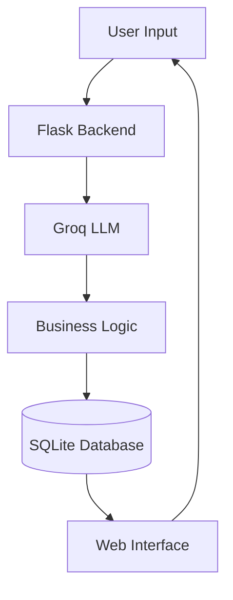

# 🌱 AI Sustainability Intelligence System

> AI-powered tools for sustainable eCommerce automation

This project implements **AI-powered sustainability modules** that help businesses automate product categorization, generate B2B sustainability proposals, and produce environmental impact reports.

---

## 🎥 Demo Video

<video src="screen-recording/screenrecorde.mp4" controls width="800"></video>

**Watch the full demo recording**

🎬 Screen recording of the system workflow:

1. Product category generation
2. B2B sustainability proposal generation
3. Sustainability impact reporting

---

# 🖥 User Interface

### Main Dashboard


### B2B Proposal Generator


### Impact Reporting Output


---

# 📊 Project Overview

This system uses **AI-powered automation** to support sustainability-focused businesses.

The platform includes **three AI modules**:

| Module                        | Description                                               |
| ----------------------------- | --------------------------------------------------------- |
| AI Product Category Generator | Automatically categorizes products and generates SEO tags |
| AI B2B Proposal Generator     | Generates sustainability proposals based on company needs |
| AI Impact Reporting Generator | Calculates environmental impact of orders                 |

The system reduces **manual effort in sustainability reporting and product classification**.

---

# 🧠 Architecture Overview



The architecture separates:

* User interface
* AI generation
* validation logic
* data storage

---

# 🤖 AI Prompt Design

Each module uses **prompt engineering** to ensure consistent structured output.

Example prompt structure:

```
You are an AI sustainability assistant.

Tasks:
1. Analyze the product description
2. Assign a category
3. Generate SEO tags
4. Identify sustainability filters

Return only valid JSON.
```

The AI is constrained to output **structured JSON**, making it easy to process programmatically.

---

# 🧩 Modules

## Module 1 — AI Auto Category Generator

Automatically categorizes products based on description.

### Input

```
Bamboo toothbrush with biodegradable handle and eco-friendly packaging
```

### Output

```json
{
 "category": "Personal Care",
 "sub_category": "Oral Care",
 "seo_tags": [
  "bamboo toothbrush",
  "eco toothbrush",
  "plastic free toothbrush"
 ],
 "sustainability_filters": [
  "plastic-free",
  "biodegradable",
  "eco-friendly"
 ]
}
```

---

## Module 2 — AI B2B Proposal Generator

Generates sustainability proposals for businesses.

### Inputs

* company name
* industry
* budget
* sustainability goals

### Output

```json
{
 "proposal_title": "Sustainable Packaging Plan",
 "product_mix": [
  {
   "product_name": "Compostable Containers",
   "category": "Packaging"
  }
 ]
}
```

---

## Module 3 — AI Impact Reporting Generator

Calculates sustainability impact of orders.

### Example Output

```json
{
 "plastic_saved_grams": 2000,
 "carbon_avoided_kg": 0.12,
 "impact_statement": "This order reduces plastic waste and carbon emissions."
}
```

---

# ⚙ Tech Stack

| Technology | Usage                |
| ---------- | -------------------- |
| Python     | Backend              |
| Flask      | Web framework        |
| Groq API   | AI model             |
| HTML/CSS   | Frontend UI          |
| SQLite     | Database             |
| JSON       | Structured AI output |

---

# 📦 Installation

Clone repository

```
git clone https://github.com/yourusername/sustainability-ai
```

Move into project

```
cd sustainability-ai
```

Install dependencies

```
pip install -r requirements.txt
```

Create `.env` file

```
GROQ_API_KEY=your_api_key_here
```

Run server

```
python app.py
```

Open in browser

```
http://127.0.0.1:5000
```

---

# 🎬 Demo Workflow

The demo shows the following process:

1️⃣ User enters product description
2️⃣ AI generates product category & tags

3️⃣ User enters company sustainability request
4️⃣ AI generates B2B proposal

5️⃣ System calculates sustainability impact

---

# 📁 Project Structure

```
project
│
├── app.py
├── proposal_ai.py
├── impact_ai.py
├── database.py
│
├── templates
│   ├── index.html
│   ├── history.html
│
├── static
│   ├── css
│   ├── images
│
└── README.md
```

---

# 🚀 Future Improvements

Possible upgrades:

* ESG scoring system
* carbon footprint analytics
* AI recommendation engine
* dashboard analytics
* API integration for external sustainability data

---

# 👨‍💻 Author

Dhruv Patil

AI Systems Internship Assignment

---

# ⭐ Acknowledgments

Powered by:

* Groq AI models
* Flask framework
* Open-source sustainability datasets
